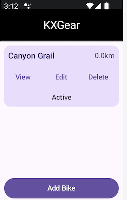
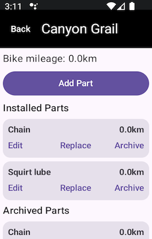
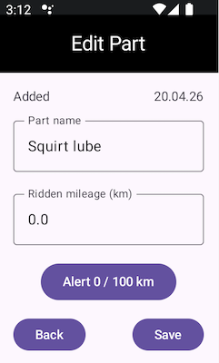

## Automatic Bike Part Mileage Tracking for Hammerhead Karoo

### AI-Powered Spec-Driven Development Workflow (using spec-kit)
This project uses **AI Spec-Driven Development**  
behavior is defined in executable-style specs first, then refined into plans, tasks, code, and tests using an AI coding agent.  
It follows the **GitHub [Spec Kit](https://github.com/github/spec-kit)** approach to keep requirements, design,  
and implementation aligned while building a Kotlin/Jetpack Compose Karoo extension for tracking bikes,   
part mileage, and maintenance history.  
Project specs: [Specs](https://github.com/itxsvv/kxgear/tree/main/specs/001-bike-parts-mileage)  
Original prompts: [Prompts](https://github.com/itxsvv/kxgear/tree/main/.ai_docs)

## Usage
Add a bike and its parts (e.g., a chain).  
The app automatically tracks and increases each part’s mileage with every ride.  
Set mileage alerts for each part. When a limit is reached, Karoo displays a notification.  
  

## Installation

Karoo 3

1. [LINK to APK](https://github.com/itxsvv/kxgear/releases/latest/download/app-release.apk)\
   Share this link with the Hammerhead Companion App.

Karoo 2:

1. Download the APK from the [releases page](https://github.com/itxsvv/kxgear/releases)
2. Set up your Karoo for sideloading. DC Rainmaker has a
   great [step-by-step guide](https://www.dcrainmaker.com/2021/02/how-to-sideload-android-apps-on-your-hammerhead-karoo-1-karoo-2.html).
3. Install the app by running `adb install app-release.apk`.

## Limitations  
KXGear does not use the embedded Karoo bike list because the Karoo SDK does not
provide a reliable way to obtain the bike selected for the current ride profile,
and bike mileage is increased only when a ride is recorded as finished.

